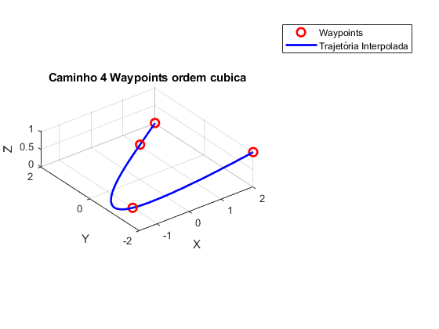

# Seguimento de Caminho

Este repositório contém a implementação de um método de seguimento de caminho para drones. Cada seção abaixo corresponde a um caminho gerado por diferentes métodos.

---

## Círculo e Lemniscata

**Geração do caminho:**  
Não há restrição de tempo para essa abordagem; foram gerados 1000 pontos correspondentes a um círculo e 1000 pontos para a lemniscata, com variação de altura.

### Imagem

### Animação/GIF
O seguimento do círculo é representado graficamente, com destaque para a orientação do drone simulado (eixos: Vermelho para X, Azul para Y e Verde para Z).  

### Resultado – Erro de Posição e Velocidade
**Erro de posição no seguimento do caminho em função do tempo:**  

**Erro de velocidade no seguimento do caminho em função do tempo:**  

O drone simulado seguiu o caminho com a velocidade desejada, regulada por meio do joystick com baixo erro. Como solicitei uma velocidade elevada pelo joystick, a escala do gráfico de velocidade acabou sendo estourada.

---

## Lemniscata

Nesta abordagem, não há restrição de tempo. O drone simulado percorre o caminho seguindo a velocidade escolhida pelo controle analógico do joystick, podendo ser pausado ou ter o sentido invertido.

### Animação/GIF

### Resultado – Erro de Posição e Velocidade
**Erro de posição no seguimento do caminho em função do tempo:**  

**Erro de velocidade no seguimento do caminho em função do tempo:**  

---

## Retas Concatenadas

Foram calculadas 3 retas com pontos que preenchem o caminho entre elas, sem restrição de tempo.

### Animação/GIF

### Resultado – Erro de Posição e Velocidade
**Erro de posição no seguimento do caminho em função do tempo:**  

**Erro de velocidade no seguimento do caminho em função do tempo:**  
Durante o experimento, trafeguei o drone sobre o caminho para frente e para trás, o que ocasionou muitas variações no sentido da velocidade.  

---

# Seguimento de Caminho – Restrição de Velocidade, Aceleração e Jerk

## Caminho – 2 Waypoints Linear

Neste caso, a velocidade não é definida pelo joystick (multiplicando a norma da direção desejada), mas sim pela definição de tempo utilizada na geração do caminho, em que cada segmento carrega a velocidade desejada. Mantive a possibilidade de controlar o sentido com o joystick, embora a velocidade deixe de ser um vetor unitário e passe a ser a velocidade necessaria para comprir a demanda e tempo.

### Caminho Gerado

**Definição da velocidade:**  
Como não há restrição, a velocidade assume o maior valor logo em tempo igual a zero. Entretanto em relação ao modelo anterior de retas concatenadas, este consegue definir o tempo que deve ser gasto entre os waypoints. E como é possivel de ser observado na simulação apresentada no GIF abaixo, o drone percorre determinada parte mais velóz que em outra, confirmando o resultado esperado pelo gerador de caminho.

### Animação/GIF – Seguimento pelo Drone
O seguimento não é suave, pois a velocidade é constante, ocorrendo um degrau no início – o que implica uma aceleração teórica infinita (limitada pelos 10°) e, portanto, uma descontinuidade na aceleração.

### Resultado – Erro de Posição e Velocidade
**Erro de posição no seguimento do caminho em função do tempo:**  

**Erro de velocidade no seguimento do caminho em função do tempo:**  
É possível observar o degrau quando a trajetória é invertida no final. Em casos mais complexos, a velocidade final é zero graças às constraints aplicadas.

---

## Caminho – 2 Waypoints Ordem Cúbica

Neste caso, a matriz A contendo as posições e as restrições é utilizada para gerar o caminho, com requisição de posição e velocidade. Devido à ordem da matriz, não é possível obter uma variação suave da aceleração; deste modo, o drone realiza mudanças de inclinação abruptas. Entretanto o resultado final é bem mais sauve que o caminho gerado pela tecnica linear. 

A posição e a velocidade são suaves ao longo do tempo, mas há descontinuidade no jerk, o que resulta em variação abrupta da aceleração.

### Animação/GIF – Seguimento pelo Drone

### Resultado – Erro de Posição, Velocidade e Orientação
**Erro de posição:**  

**Erro de velocidade:**  

**Erro de orientação:**  

Observa-se que o drone satura a 100° até se aproximar da orientação desejada. Um ganho de orientação elevado não é interessante em um modelo real, pois demanda muita energia.

---

## Caminho – 2 Waypoints 5ª Ordem

Nesta abordagem, a matriz de posições e restrições é de ordem superior, permitindo continuidade na variação da aceleração, que se torna suave.

### Animação/GIF – Seguimento pelo Drone

Nota: Observa-se que o início e o fim da trajetória ocorrem de forma suave, com a maior velocidade próxima ao centro da reta, isso graças as restrições impostas na contrução da matriz A.  

### Resultado – Erro de Posição, Velocidade e Orientação

---

## Caminho – 4 Waypoints Linear

Nesta abordagem, a velocidade respeita apenas o valor necessário para ir de um ponto a outro, resultando em descontinuidade na aceleração.

### Caminho Gerado

**Definição da velocidade:**  

### Animação/GIF – Seguimento pelo Drone
Devido à velocidade constante, há um degrau que implica aceleração infinita (limitada pelos 10°).

### Resultado – Erro de Posição e Velocidade
**Erro de posição:**  

**Erro de velocidade:**  
É possível observar o degrau quando a trajetória é invertida; nos casos mais complexos, a velocidade final é zero graças às constraints.

---

## Caminho – 4 Waypoints Ordem Cúbica

Neste caso, utiliza-se uma matriz de posições e restrições para gerar o caminho, com requisição de posição, velocidade e aceleração. Devido à ordem da matriz, não é possível obter uma variação suave da aceleração, resultando em mudanças de inclinação abruptas.

A posição e a velocidade são suaves, mas o jerk apresenta descontinuidade, ocasionando variações abruptas na aceleração entre os waypoints.

### Animação/GIF – Seguimento pelo Drone

### Resultado – Erro de Posição, Velocidade e Orientação
**Erro de posição:**  

**Erro de velocidade:**  

**Erro de orientação:**  
Com polinômio de ordem cúbica, não é possível obter variação constante da aceleração; o jerk apresenta descontinuidade, corrigido em polinômios de ordem superior com constraints apropriadas.

---

## Caminho – 4 Waypoints 5ª Ordem

Nesta abordagem, a matriz de posições e restrições é de ordem superior, permitindo continuidade na variação da aceleração, que se torna suave.

### Animação/GIF – Seguimento pelo Drone

### Resultado – Erro de Posição, Velocidade e Orientação
**Erro de posição:**  

**Erro de velocidade:**  

**Erro de orientação:**  

---

## Arquivos MATLAB

### PolePlance_and_LQR.m

O código utilizado para escolher os ganhos nas simulações está disponível neste arquivo.

### Simulador3d_for_spacestates_caminho.m

Script utilizado para realizar as simulações em espaço de estados.

---

*Observação:*  
Substitua os textos entre parênteses com descrições detalhadas conforme sua necessidade. Certifique-se de que os nomes dos arquivos de imagem e GIF estejam corretos e correspondam aos nomes reais presentes em cada pasta.
